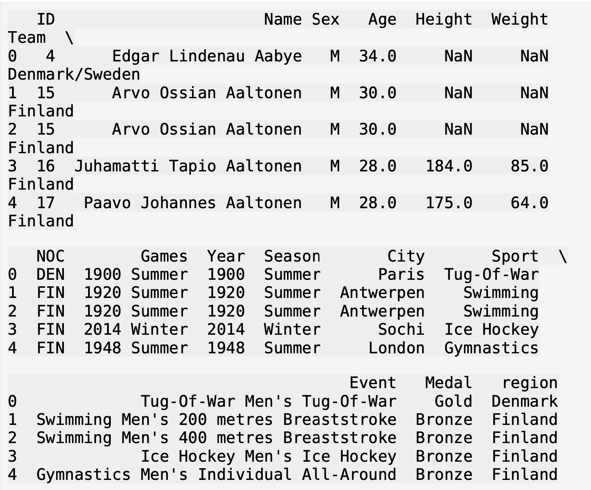
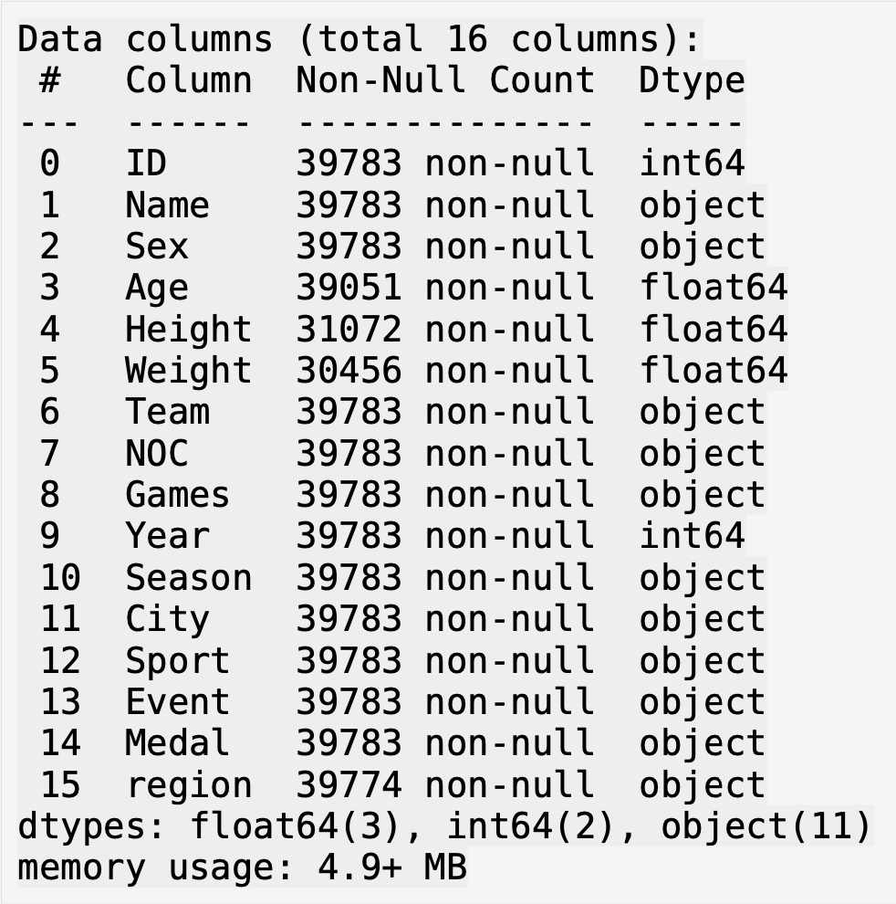
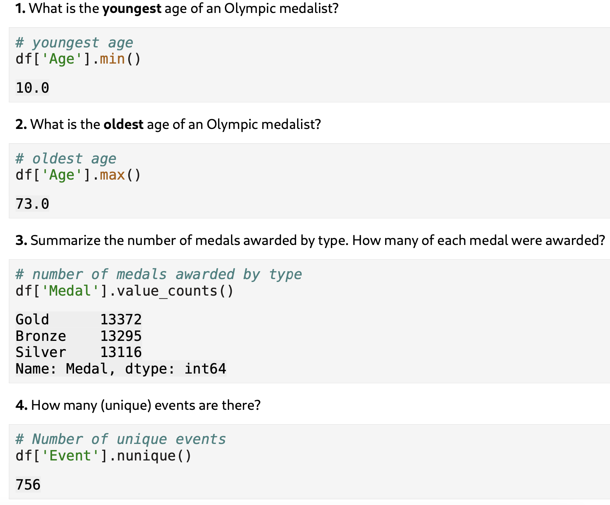
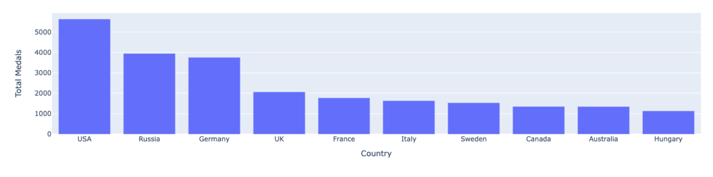
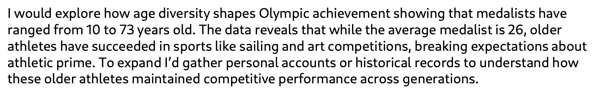

# Olympic Athletes Data Analysis

Data analysis of Olympic medalists from 1896–2016 using Python, pandas, and data visualization.

---

## Overview

This project explores trends in Olympic athlete data, focusing on age distribution, medal counts, and country performance. The goal is to uncover patterns in Olympic success and highlight insights that could support data-driven storytelling.

---

## Tools Used

- Python  
- pandas  
- Plotly  
- Jupyter Notebook  

---

## Data Sample

Preview of the dataset used in this analysis:

---

## Data Structure & Cleaning

Inspection of dataset structure, data types, and missing values:

Key cleaning steps:
- Renamed `NOC` → `CountryCode`
- Renamed `region` → `Country`
- Removed unnecessary columns (e.g., `Team`)
- Identified and handled missing values in columns like Age, Height, and Weight

---

## Key Statistics

Summary of core findings from the dataset:

- Youngest medalist: **10 years old**
- Oldest medalist: **73 years old**
- Total medals:
  - Gold: 13,372  
  - Silver: 13,116  
  - Bronze: 13,295  
- Total unique events: **756**

---

## Top 10 Countries by Medal Count

Visualization of the most successful countries in Olympic history:

The United States leads by a significant margin, followed by Russia and Germany.

---

## Key Insights

- Olympic medalists range widely in age, from **10 to 73 years old**
- The average medalist age is approximately **26 years old**
- Older athletes tend to succeed in sports such as **sailing and art competitions**
- Medal distribution highlights strong dominance from countries like the **USA, Russia, and Germany**
- The data challenges traditional assumptions about athletic prime and longevity

---

## Business / Analytical Interpretation

The analysis highlights how Olympic success is influenced by both age and specialization. While most athletes peak in their mid-20s, certain sports allow for extended careers, emphasizing experience and skill over physical peak performance.

These findings could support deeper research into athlete longevity, training strategies, and sport-specific performance trends.

---

## Project File

- `M7_Olympics.ipynb` — Full analysis and code

---

## Author

Jacob Bargeron  
Cyber Engineering Student — University of Arizona  
Aspiring Cybersecurity / Data Analyst
